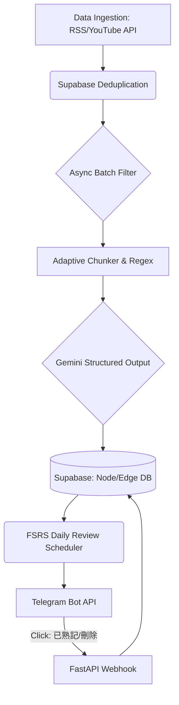

## 🚀 KnowFetch

**KnowFetch** 是一個「零維運成本」的個人化技術知識圖譜系統。它能全自動抓取技術長文並透過 YouTube API 同步優質頻道影片，利用 LLM 萃取精華並生成具備完整程式碼的知識卡片，最後透過 Telegram 與 FSRS (間隔重複) 演算法推播給你複習。在極度受限的免費雲端資源下，實作了穩定且高可用的資料管線。

---

### 📊 系統每天的實際運作流程 (Daily Workflow)

1. **RSS 自動巡邏與 YouTube API 整合**：每日定時巡邏知名技術網站 (如 **KDnuggets**、**Towards Data Science**) 的 RSS，並透過 YouTube Data API v3 精準抓取優質 YouTube 技術頻道 (如 [**Hung-yi Lee**](https://www.youtube.com/@HungyiLeeNTU)、[**陳縕儂Vivian NTU MiuLab**](https://www.youtube.com/c/VivianNTUMiuLab)) 的最新影片清單與字幕。
2. **AI 精準篩選與管道分流**：對於技術網誌長文，系統會利用 LLM 依據個人喜好 (如: 只保留 AI/Python 相關文章) 即時過濾雜訊；而對於優質的 YouTube 頻道影片則設置為直接放行（Bypass LLM），確保每一部影片都能被百分之百收錄，同時節省 API Quota。
3. **長文拆解與代碼保護**：針對優質長文，系統會自動下載全文，並使用 Python 特殊正則處理，確保切塊時「範例程式碼」的完整無缺，避免程式碼被從中截斷。
4. **大局觀萃取與翻譯**：將極大片段 (最高 60,000 字元) 餵給 AI 進行全局掃視，摒棄初階語法，精準提煉「最佳實踐 (Best Practices)」，並將上下文翻譯成繁體中文（原本的程式碼原樣保留）。
5. **動態推播與黑名單反饋**：每日根據 FSRS 排程，發送深刻的技術卡片至 Telegram。用戶可點擊卡片下方的「🗑️ 略過/刪除整篇文章」互動按鈕，透過 FastAPI Webhook 即時刪除該篇文章的「所有」關聯內容，並將該網址自動加入 `ignored_urls` 黑名單，確保系統未來永不重複爬取。

---

### 💡 系統設計與架構決策 (Engineering Trade-offs)

1. **Mega-Context Regex 萃取防截斷**  
   - **痛點**：隨意切塊長文常導致代碼截斷與語意破碎。
   - **解法**：以 Python Regex 鎖定保護 Code Blocks 作為「不可置換單元」，並把 Chunk Size 擴大至 60k token。強迫 LLM 以全局視角產出具備「發生情境、解決痛點、完整程式碼」的 Self-contained 獨立知識卡片。
2. **PostgreSQL 模擬邏輯圖譜 (NoSQL to RDBMS)**  
   - **理由**：為了完全零成本，且替未來的 RAG 向量搜尋 (`pgvector`) 鋪路，捨棄昂貴的圖形庫 (Neo4j)。
   - **解法**：利用 Supabase (PostgreSQL) 關聯表的外鍵與 SQL JOIN 模擬出點與邊 (Nodes/Edges) 的圖譜拓撲結構，以最低成本實現圖譜關係探索。
3. **Semaphore 併發限流防禦 (Strict Rate-Limiting)**  
   - **痛點**：免費 LLM API 擁有極嚴苛的 `15 RPM` 限制，易觸發 HTTP 429 被永久封鎖。
   - **解法**：系統底層實作了帶有 `asyncio.Semaphore` 與動態 `sleep` 冷卻佇列的非同步批次過濾器，實現平滑化的流量控制，杜絕請求中斷。
4. **防禦 Scale-to-Zero 的 Serverless 架構設計 (Hugging Face Spaces)**  
   - **痛點**：部署於 Hugging Face Spaces 等免費雲端平台，在發送 HTTP 響應後會立即凍結 CPU 節省資源 (Scale-to-Zero)，導致傳統的 `BackgroundTasks` 行為中斷、排程跑到一半卡死。
   - **解法**：取消背景任務分離，直接由 FastAPI Endpoint 以 `await` 壓住 HTTP 連線，強迫機器保持甦醒狀態直至爬蟲管線與推播完畢。此外 Telegram 推播加入 IPv4 綁定與 Exponential Backoff 重試機制，成功馴服嚴苛的免費雲端環境。

---

### 🏗️ 系統架構 (Architecture)



### 🛠️ Tech Stack
- **Backend Core**: Python 3.10+, `FastAPI`, `asyncio`, `httpx`
- **NLP & AI**: Google GenAI SDK (`Gemini 3.1 Flash-Lite`), `Regex`, `BeautifulSoup4`
- **Scraping**: `youtube-transcript-api`, YouTube Data API v3
- **Database**: Supabase (`PostgreSQL`)
- **Integration**: Telegram Bot API

---

### 💻 快速啟動 (Quick Start)

```bash
git clone https://github.com/yourusername/knowfetch.git
cd knowfetch
pip install -r requirements.txt
```

設定 `.env` 變數 後方能啟動：
```env
GEMINI_API_KEY=your_gemini_api_key
SUPABASE_URL=your_supabase_url
SUPABASE_KEY=your_supabase_anon_key
TELEGRAM_BOT_TOKEN=your_telegram_bot_token
YOUTUBE_API_KEY=your_youtube_v3_api_key
CRON_SECRET=your_cron_secret
REVIEW_BATCH_SIZE=2
```

### 🏃 如何執行

**1. 啟動 FastAPI 伺服器 (支援 Webhook 與 Cron 排程觸發)：**
```bash
uvicorn app.main:app --host 0.0.0.0 --port 7860 --reload
```

**2. 自動化排程 (外部 Cron Job)：**
系統設計運行於 Hugging Face Spaces 等雲端，請使用 cron-job.org 或 GitHub Actions 等外部服務定時 POST 以下 API 端點（需夾帶 Security Header）來觸發執行：
```bash
# ==========================================
# 觸發管線：抓取最新文章、拆解並寫入知識庫
# ==========================================
curl -X POST "https://<你的-HF-Space-網址>/trigger-pipeline" \
     -H "x-cron-secret: your_cron_secret"

# ==========================================
# 觸發推播：透過 Telegram 發送每日複習卡片
# ==========================================
curl -X POST "https://<你的-HF-Space-網址>/trigger-review" \
     -H "x-cron-secret: your_cron_secret"
```
